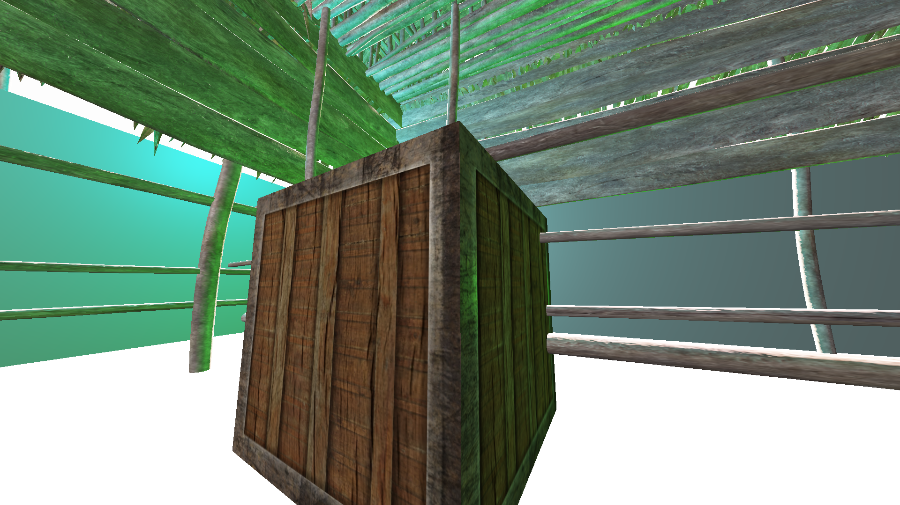
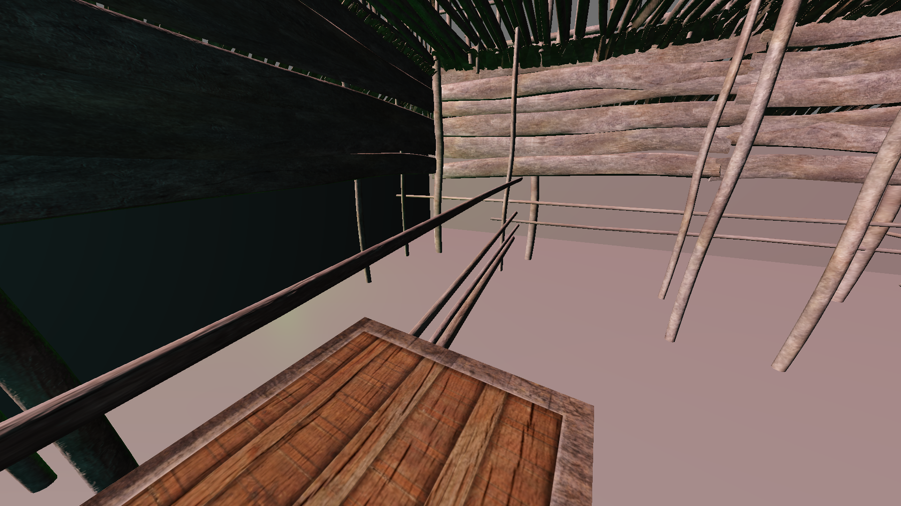

# a-level-project

[Archived]

Lightweight game framework created for my CS A-Level programming project (NEA).

Uses OpenGL for rendering and a Bullet Physics backend for physics.

---

~~Procedurally generated dungeon crawler, written in C++ and OpenGL~~

---

